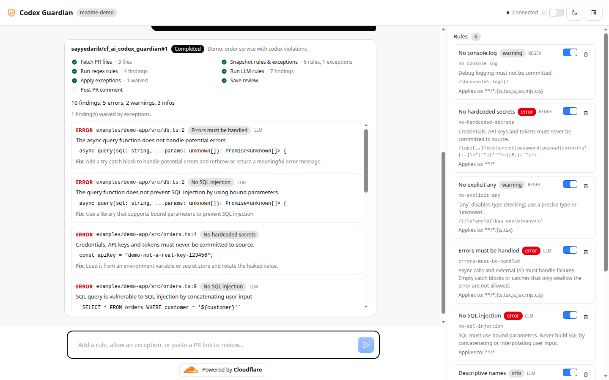
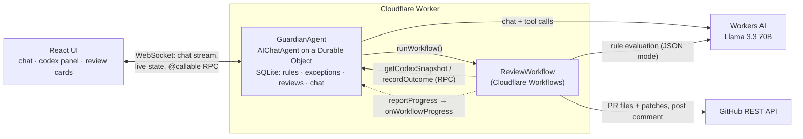

# Codex Guardian

**An AI agent that reviews GitHub pull requests against your team's engineering standards — "the codex".**

You manage the codex by chatting ("add a rule: no TODO without a ticket", "allow console.log in scripts/\*\*"), then ask for a review. A durable workflow fetches the PR, runs cheap regex rules and then LLM rules, drops anything an exception covers, and explains every finding with **file, line, the rule it broke, and how to fix it** — live, step by step.

**Live demo:** https://codex-guardian.sayyedaribhussain4321.workers.dev
(Each team gets its own codex: add `?codex=your-team` to the URL.)



Built on Cloudflare for the AI app assignment:

| Requirement                 | How it's met                                                                                                                                                                                      |
| --------------------------- | ------------------------------------------------------------------------------------------------------------------------------------------------------------------------------------------------- |
| **LLM**                     | Llama 3.3 70B (`@cf/meta/llama-3.3-70b-instruct-fp8-fast`) on Workers AI, for chat _and_ rule evaluation                                                                                          |
| **Workflow / coordination** | `GuardianAgent` (Agents SDK `AIChatAgent` on a Durable Object) coordinates chat and state; `ReviewWorkflow` (Cloudflare Workflows via `AgentWorkflow`) runs each review step durably with retries |
| **User input**              | React chat UI served by the same Worker, built on the agents-starter and Kumo components                                                                                                          |
| **Memory / state**          | Rules, exceptions and review history in the agent's SQLite; chat history persisted by `AIChatAgent`; state synced live to every open tab                                                          |

## Architecture



### The review workflow

Each external call is its own `step.do`, so it's retried with backoff and never repeated once it succeeds. Progress is pushed to the agent after every step and shown in the review card.

1. **Fetch PR** — PR metadata and per-file patches from GitHub. 4xx errors (bad URL, private repo without token) fail fast instead of burning retries.
2. **Snapshot codex** — the enabled rules and exceptions are copied, so edits made mid-review don't change the result.
3. **Regex rules** — matched against the lines the PR _adds_, with real new-file line numbers.
4. **LLM rules** — added lines are split into small batches (≤120 lines × ≤4 rules, 4 in parallel). The model gets numbered lines and must answer in JSON. Output is validated with zod; a finding for an unknown rule or a line that isn't in the batch is discarded, so the model can't invent locations. A batch that keeps failing is skipped and noted — **a bad LLM response never fails the review**.
5. **Apply exceptions** — findings waived by an exception (rule + file glob) are dropped and counted.
6. **Save review** — stored in SQLite and synced to the UI.
7. **Post PR comment (optional)** — only if you asked for it. The workflow then **waits (durably, up to 24h) for you to click Approve** in the chat before posting.

## Run it locally

Requirements: Node 24 LTS, a Cloudflare account (Workers AI runs remotely, even in dev).

```sh
npm install
npx wrangler login          # once
cp .dev.vars.example .dev.vars   # optional: add a GITHUB_TOKEN
npm run dev                 # http://localhost:5173
```

```sh
npm test        # unit tests (vitest)
npm run check   # format + lint + typecheck + tests
```

### GitHub token (optional)

Public repos work without a token (GitHub allows 60 unauthenticated requests/hour). A token is needed for private repos, higher limits, and posting PR comments.

Use a **fine-grained personal access token** limited to the repos you want reviewed, with _Pull requests: read and write_ and _Contents: read_. Locally put it in `.dev.vars`; in production:

```sh
npx wrangler secret put GITHUB_TOKEN
```

## Deploy

```sh
npm run deploy   # vite build && wrangler deploy
```

This deploys the Worker, the `GuardianAgent` Durable Object (SQLite-backed) and the `codex-review` Workflow.

## Demo script

1. Open the app (or `?codex=demo` for a fresh codex). The panel on the right shows six starter rules (3 regex, 3 LLM).
2. **"What rules are in our codex?"** — the agent reads the codex and summarises it.
3. **"Add a rule: no TODO comments without a ticket like ABC-123"** — it picks a regex rule and writes the pattern; the new rule appears in the panel instantly.
4. **"Add a rule that functions must have JSDoc comments"** — this needs judgement, so it becomes an LLM rule.
5. **"Allow console.log in scripts/\*\* because build scripts print progress"** — adds an exception instead of weakening the rule.
6. **"Review https://github.com/sayyedarib/cf_ai_codex_guardian/pull/1"** — a demo PR that breaks rules on purpose. Watch the steps tick through; findings include the hardcoded key, SQL built from input, the empty `catch`, `any`, `console.log` (but not the one in `scripts/`, which is waived) and vague names.
7. **"Explain the SQL injection finding"** — the agent pulls the report and explains file, line, rule and fix.
8. Toggle or delete a rule in the panel, then review again to see the difference. With a `GITHUB_TOKEN` set, ask **"Review … and post a summary comment"** and approve it in the card.

## Design notes

- **Pure core, thin adapters.** Everything in `src/review/` (diff parsing, glob matching, regex rules, LLM batching and output parsing, exceptions, report formatting, review state transitions) has no Cloudflare imports and is unit tested. The LLM is injected as a `(messages) => Promise<string>` function.
- **Making Llama 3.3 reliable for tool use.** Findings from testing, each handled in one small module:
  - A long system prompt makes it stop calling tools → the prompt is a few lines and guidance lives in tool descriptions.
  - One "add rule" tool with a `kind` switch made it write the call as text → split into `addRegexRule` and `addLlmRule`.
  - It sometimes still writes a tool call as JSON text, especially in long chats → a model middleware (`src/llm/leaked-tool-calls.ts`) turns those into real tool calls, and only the last 10 messages are sent.
  - It sends booleans as `"false"` → tool schemas accept both.
  - `workers-ai-provider` 4.0.0 emitted every streamed token and tool call twice (Workers AI sends both native and OpenAI-style fields) → `src/llm/dedupe-stream.ts` filters the duplicates until that's fixed upstream.
- **State is a projection.** SQLite is the source of truth; after every change the agent pushes `{ rules, exceptions, recent reviews }` to all clients. Clients can't write state directly — only through validated `@callable` methods.

## Limitations

- No authentication: anyone with the URL and a codex name can edit that codex. Fine for a demo; production would put Cloudflare Access or OAuth in front.
- Reviews look at added lines only (not whole files), up to 60 files and 30 LLM batches per PR; the report says when limits were hit.
- LLM rules are only as good as the model. Findings are labelled `LLM` vs regex in the UI.

## Project layout

See [AGENTS.md](AGENTS.md) for the structure, conventions and commands. [PROMPTS.md](PROMPTS.md) has the prompts used to build this with AI assistance.
